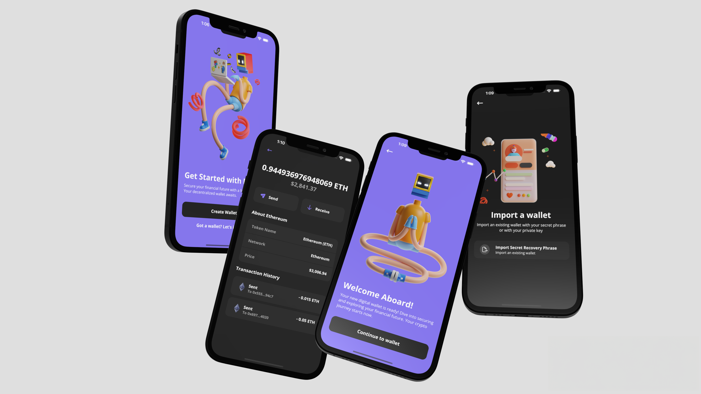

<a name="readme-top"></a>

[![LinkedIn][linkedin-shield]][linkedin-url]

<br />
<div align="center">
  <a>
    
  </a>

  <h3 align="center">React Native Crypto Wallet</h3>

  <p align="center">
    A simple react native crypto wallet
    <br />
    <a>Demo coming soon</a>
    ·
    <a href="https://github.com/vinnyhoward/rn-crypto-wallet/issues">Report Bug</a>
  </p>
</div>

This project is a React Native application for managing cryptocurrency transactions and balances. It utilizes the Expo framework, the Alchemy API for blockchain interaction, and is built with a focus on Ethereum and Solana cryptocurrencies.


## Roadmap
- [x] Create wallet
- [x] View seed phrase
- [x] Confirm seed phrase
- [x] Import wallet
- [x] View all asset net worth
- [x] View Ethereum balance
- [x] View Solana balance
- [ ] Switch accounts
- [ ] Send Ethereum
- [x] List transactions on Ethereum
- [ ] Send Solana
- [ ] List transactions transactions on Solana

### Nice to haves
- [ ] UI improvements - android ui bugs, loaders, animation, etc
- [ ] Refactor repeating styled components and some logic
- [ ] Improve security (its never going to be in production but it'd be fun to add)

## Prerequisites

Before you begin, ensure you have the following installed:
- Node.js (v14.x or later)
- Yarn (v1.22.x or later)
- Expo CLI (`npm install -g expo-cli`)

## Quick Start

To get the project up and running on your local machine, follow these steps:

1. Clone the repository:

```bash
git clone https://github.com/vinnyhoward/react-native-crypto-wallet.git
cd react-native-crypto-wallet
```

2. Install dependencies:

```bash
yarn install
```

3. Set up environment variables. Rename .env.example to .env and update the following keys with appropriate values:

```bash
EXPO_PUBLIC_ALCHEMY_KEY=your_alchemy_key
EXPO_PUBLIC_ALCHEMY_URL=https://eth-sepolia.g.alchemy.com/v2/
EXPO_PUBLIC_ALCHEMY_SOCKET_URL=wss://eth-sepolia.g.alchemy.com/v2/
EXPO_PUBLIC_ENVIRONMENT=development 
```

4. Start the development server:

```bash
expo start
```

## Features

- View Ethereum and Solana balance and transactions
- Send and receive cryptocurrencies
- Connect to blockchain networks via Alchemy API
- Responsive UI compatible with both iOS and Android devices


## Environment Variables

`EXPO_PUBLIC_ALCHEMY_KEY`: Your Alchemy API key for accessing Ethereum blockchain data.

`EXPO_PUBLIC_ALCHEMY_URL`: The base URL for Alchemy API requests.

`EXPO_PUBLIC_ALCHEMY_SOCKET_URL`: The WebSocket URL for real-time updates from Alchemy.

`EXPO_PUBLIC_ENVIRONMENT`: Environment setting, e.g., development or production.


[linkedin-shield]: https://img.shields.io/badge/-LinkedIn-black.svg?style=for-the-badge&logo=linkedin&colorB=555
[linkedin-url]: https://www.linkedin.com/in/vinnyhoward/