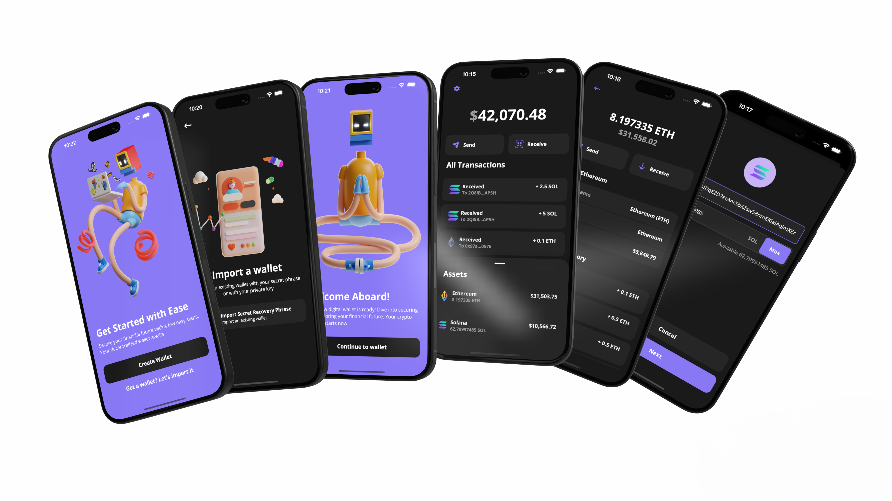

[![LinkedIn][linkedin-shield]][linkedin-url]

<br />
<div align="center">
  <a>
    
  </a>

  <div style="margin-top:20px; margin-bottom:20px;">
  
    <h1 align="center">BMO Wallet</h1>
  </div>

  <p align="center">
    A crypto wallet built with React Native
    <br />
    <a>Demo coming soon</a>
    ·
    <a href="https://github.com/vinnyhoward/rn-crypto-wallet/issues">Report Bug</a>
    ·
    <a href="https://github.com/vinnyhoward/rn-crypto-wallet/issues/new?labels=enhancement&template=feature-request---.md">Request Feature</a>
  </p>
</div>

## Introduction[](#introduction)

This project is a React Native application for managing cryptocurrency transactions and balances. It utilizes the Expo framework, the Alchemy API for blockchain interaction, and is built with a focus on Ethereum and Solana cryptocurrencies.

### Testnet-Only Application
This application is designed solely for interaction with the Ethereum Sepolia testnet and the Solana Devnet. **Do not use real wallets or any wallets containing actual cryptocurrencies with this app.** Ensure you use wallet addresses generated within this app or other testnet-specific wallets that hold no real-world value.

#### Testnet Resources
- **Ethereum (Sepolia Testnet)**: Obtain free Sepolia testnet ETH from the [Sepolia Faucet](https://www.infura.io/faucet/sepolia).
- **Solana (Devnet)**: Acquire free SOL tokens from the [Solana Devnet Faucet](https://faucet.solana.com/).

### Network Configuration Assurance
Ensure the `.env` variables are set to connect only to these testnet environments to prevent any real cryptocurrency transactions. Always use testnet addresses when interacting with this application.

## Table of Contents[](#table-of-contents)
- [Tech Stack](#tech-stack)
- [Features](#features)
- [Quick Start](#quick-start)
- [Roadmap](#roadmap)
- [License](#license)
- [Contact](#contact)

## Tech Stack[](#tech-stack)

This project leverages a modern tech stack for building and managing a cross-platform cryptocurrency wallet application:

* [![typescript][typescript]][ts-url] - A strongly typed programming language that builds on JavaScript, giving you better tooling at any scale.

* [![react-native][react-native]][rn-url] - A framework for building native apps using React, enabling native mobile development with JavaScript.

* [![expo][expo]][expo-url] - An open-source platform for making universal native apps with React that run on Android, iOS, and the web.

* [![redux][redux]][redux-url] - A predictable state container for JavaScript apps, used for managing state in the mobile app.

* [![styled-components][styled-components]][sc-url] - A library that utilizes tagged template literals to style your components at a component level using CSS.

* **Ethers.js** - A complete Ethereum wallet implementation and utilities in JavaScript (and TypeScript), used for blockchain interactions.

* **@solana/web3.js** - Solana’s JavaScript API library, enabling interaction with the Solana Blockchain.

* **Alchemy SDK** - A powerful toolkit that simplifies the process of making requests to the Blockchain, enhancing the app’s capability to interact with Ethereum and Solana.

<div align="right">[ <a href="#introduction">↑ Back to top ↑</a> ]</div>

---


## Features[](#features)

### Wallet Management
- **Create Wallet**: Generate new wallets seamlessly.
- **Import Wallets**: Import existing wallets using mnemonic phrases.
- **Manage Multiple Wallets**: Create and manage multiple wallets using the same mnemonic phrase.
- **Account Management**: Rename and manage different wallet accounts.
- **Switch Wallets**: Easily switch between different wallet accounts.

<div style="display: flex;">
  <figure style="text-align: center; display: flex; flex-direction: column;">
    
    <!-- <figcaption style="font-size: 14px;">Creating a new wallet</figcaption> -->
  </figure>

  <figure style="text-align: center; display: flex; flex-direction: column;">
    
    <!-- <figcaption style="font-size: 14px;">Importing a wallet</figcaption> -->
  </figure>
    <figure style="text-align: center; display: flex; flex-direction: column;">
    
    <!-- <figcaption style="font-size: 14px;">Managing your wallet</figcaption> -->
  </figure>
</div>

### Wallet Balance and Transactions
- **Net Worth**: View the total net worth across all wallets.
- **Balance Viewing**: Check the balance of Ethereum and Solana wallets.
- **Transaction Management**:
  - Send and receive Ethereum and Solana transactions.
  - View a list of past transactions for both Ethereum and Solana.

<div style="display: flex;">
  <figure style="text-align: center; display: flex; flex-direction: column;">
    
    <!-- <figcaption style="font-size: 14px;">Viewing wallet networth and transactions</figcaption> -->
  </figure>

  <figure style="text-align: center; display: flex; flex-direction: column;">
    
    <!-- <figcaption style="font-size: 14px;">Viewing balance of Ethereum</figcaption> -->
  </figure>
    <figure style="text-align: center; display: flex; flex-direction: column;">
    
    <!-- <figcaption style="font-size: 14px;">Sending Ethereum</figcaption> -->
  </figure>
</div>

### Accessibility Features
- **QR Code Functionality**: Easily share wallet addresses and send cryptocurrencies via QR codes.

<div style="display: flex;">
  <figure style="text-align: center; display: flex; flex-direction: column;">
    
    <!-- <figcaption style="font-size: 14px;">Viewing wallet networth and transactions</figcaption> -->
  </figure>

  <!-- <figure style="text-align: center; display: flex; flex-direction: column;">
    
    <figcaption style="font-size: 14px;">Viewing balance of Ethereum</figcaption>
  </figure>
    <figure style="text-align: center; display: flex; flex-direction: column;">
    
    <figcaption style="font-size: 14px;">Sending Ethereum</figcaption>
  </figure> -->
</div>

### Security

This application prioritizes security while still under development:

- **Secure Storage**: Sensitive data such as wallet phrases and keys are encrypted using advanced encryption methods before being securely stored locally on the device. This uses React Native's `SecureStore` module to ensure data protection.
- **Data Encryption**: Utilizes `aesEncryptHelpers` for robust encryption and decryption of wallet phrases, enhancing data confidentiality.
- **Secure Communication**: All network communications are secured and wallet interactions do not transmit private keys over the network.
- **Local Storage Safety**: For platforms supporting web capabilities, local storage is used as a fallback, with appropriate error handling to manage data securely.
- **Redundant Safety Checks**: The app includes multiple checks to clear sensitive data securely to prevent data leakage.
- **Future Security Enhancements**: Plans include integrating biometric authentication to add an extra layer of security.


<div align="right">[ <a href="#introduction">↑ Back to top ↑</a> ]</div>

---


## Quick Start[](#quick-start)

### Prerequisites

Before you begin, ensure you have the following installed:
- Node.js (v14.x or later)
- Yarn (v1.22.x or later)
- Expo CLI (`npm install -g expo-cli`)

### Getting Started

To get the project up and running on your local machine, follow these steps:

1. Clone the repository:

```bash
git clone https://github.com/vinnyhoward/react-native-crypto-wallet.git
cd react-native-crypto-wallet
```

2. Install dependencies:

```bash
yarn install
```

3. Set up environment variables. Rename .env.example to .env and update the following keys with appropriate values:

```bash
EXPO_PUBLIC_ALCHEMY_ETH_KEY=YOUR_ALCHEMY_KEY
EXPO_PUBLIC_ALCHEMY_ETH_URL=https://eth-sepolia.g.alchemy.com/v2/

EXPO_PUBLIC_ALCHEMY_SOCKET_URL=wss://eth-sepolia.g.alchemy.com/v2/

EXPO_PUBLIC_ALCHEMY_SOL_URL=https://solana-devnet.g.alchemy.com/v2/
EXPO_PUBLIC_ALCHEMY_SOL_API_KEY=YOUR_ALCHEMY_KEY

EXPO_PUBLIC_ENVIRONMENT=development
EXPO_PUBLIC_PASSWORD=
EXPO_PUBLIC_SALT=

```

4. Start the development server:

```bash
expo start
```

### Environment Variables

`EXPO_PUBLIC_ALCHEMY_ETH_KEY`: Your Alchemy API key for accessing Ethereum blockchain data.

`EXPO_PUBLIC_ALCHEMY_ETH_URL`: The base URL for Ethereum Alchemy API requests.

`EXPO_PUBLIC_ALCHEMY_SOCKET_URL`: The WebSocket URL for real-time updates from Alchemy.

`EXPO_PUBLIC_ALCHEMY_SOL_URL`: The base URL for Solana Alchemy API requests.

`EXPO_PUBLIC_ALCHEMY_SOL_API_KEY`: Your Alchemy API key for accessing Solana blockchain data.

`EXPO_PUBLIC_ENVIRONMENT`: Environment setting, e.g., development or production.

`EXPO_PUBLIC_PASSWORD`: Needed for encryption

`EXPO_PUBLIC_SALT`: Needed for encryption

<div align="right">[ <a href="#introduction">↑ Back to top ↑</a> ]</div>

---


## Roadmap [](#roadmap)

- [x] Confirmation screen
- [ ] Animations: 
  - [x] Confirmation screen
  - [ ] Splash screen
  - [x] Create wallet screen
- [x] Improve redux structure 
- [ ] Pagination
- [ ] Add profit/loss UI for assets purchased
- [ ] Adding Polygon Blockchain
- [ ] Listing NFT transactions for all blockchains
- [ ] Implement biometric authentication to add an additional layer of security

<div align="right">[ <a href="#introduction">↑ Back to top ↑</a> ]</div>

---


## License [](#license)

Distributed under the MIT License. See `LICENSE.txt` for more information.

<div align="right">[ <a href="#introduction">↑ Back to top ↑</a> ]</div>

---


## Contact [](#contact)

Vincent Howard - [@NiftyDeveloper](https://twitter.com/NiftyDeveloper) - vincenguyenhoward@gmail.com

Project Link: [https://github.com/vinnyhoward/rn-crypto-wallet](https://github.com/vinnyhoward/rn-crypto-wallet)

<div align="right">[ <a href="#introduction">↑ Back to top ↑</a> ]</div>

---


[linkedin-shield]: https://img.shields.io/badge/-LinkedIn-black.svg?style=for-the-badge&logo=linkedin&colorB=555
[linkedin-url]: https://www.linkedin.com/in/vinnyhoward/

[typescript]: https://img.shields.io/badge/typescript-%23007ACC.svg?style=for-the-badge&logo=typescript&logoColor=white
[ts-url]: https://www.typescriptlang.org/

[react-native]: https://img.shields.io/badge/react_native-%2320232a.svg?style=for-the-badge&logo=react&logoColor=%2361DAFB
[rn-url]: https://reactnative.dev/

[expo]: https://img.shields.io/badge/expo-1C1E24?style=for-the-badge&logo=expo&logoColor=#D04A37
[expo-url]: https://docs.expo.dev/

[styled-components]: https://img.shields.io/badge/styled--components-DB7093?style=for-the-badge&logo=styled-components&logoColor=white
[sc-url]: https://styled-components.com/

[redux]: https://img.shields.io/badge/redux-%23593d88.svg?style=for-the-badge&logo=redux&logoColor=white
[redux-url]: https://styled-components.com/