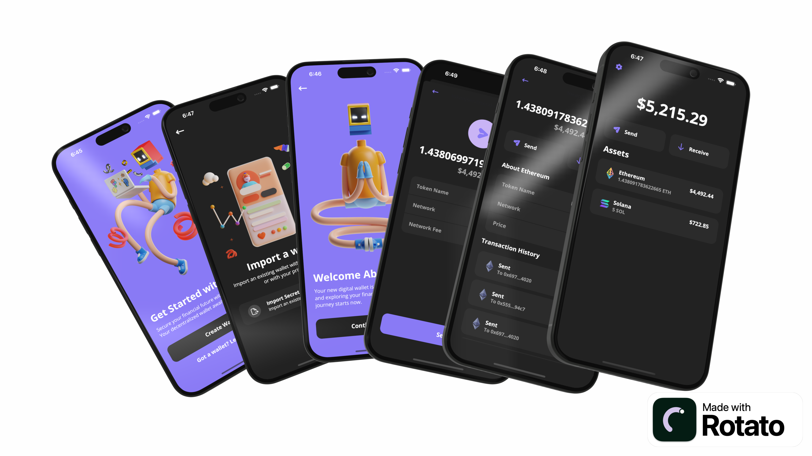

<a name="readme-top"></a>

[![LinkedIn][linkedin-shield]][linkedin-url]

<br />
<div align="center">
  <a>
    
  </a>

  <h3 align="center">React Native Crypto Wallet</h3>

  <p align="center">
    A simple react native crypto wallet
    <br />
    <a>Demo coming soon</a>
    ·
    <a href="https://github.com/vinnyhoward/rn-crypto-wallet/issues">Report Bug</a>
  </p>
</div>

This project is a React Native application for managing cryptocurrency transactions and balances. It utilizes the Expo framework, the Alchemy API for blockchain interaction, and is built with a focus on Ethereum and Solana cryptocurrencies.

## Important Safety Information

__Testnet-Only Application__: This application is specifically designed for interaction with the Sepolia testnet for Ethereum and the Solana Devnet. It is crucial that you do not use real wallets or wallets containing actual cryptocurrencies with this application. Use this app strictly with wallet addresses generated within this application or with other testnet wallets that do not hold any real value.

The testnet environments allow developers and users to experiment with blockchain features without any financial risk. Testnet tokens do not have real-world value but mimic the behavior of actual tokens to allow comprehensive testing and interaction:

- Ethereum (Sepolia Testnet): You can obtain Sepolia testnet ETH from the [Sepolia Faucet](https://www.infura.io/faucet/sepolia), which provides free testnet tokens.

- Solana (Devnet): For testing on the Solana blockchain, use the [Solana Devnet Faucet](https://faucet.solana.com/) to receive free SOL tokens for the Devnet.

__Network Configuration Assurance__:It is crucial to understand that as long as the `.env` variables are correctly set to point to these testnet environments, the application cannot connect to the mainnet. Ensuring there is no risk of accidental transactions involving real cryptocurrencies. Please be diligent in using only testnet addresses while interacting with this application.

__Note__: The security architecture for this project is currently in a developmental phase and has not yet been fully implemented. It is intended solely for development and testing purposes, with plans to enhance security features in future updates.

## Roadmap
#### Wallet Functionality
- [x] Create wallet
- [x] View seed phrase
- [x] Confirm seed phrase
- [x] Import wallet
- [ ] Switch accounts

#### Wallet Balance
- [x] View all asset net worth
- [x] View Ethereum balance
- [x] View Solana balance

#### Ethereum Actions
- [x] Send Ethereum
- [x] List transactions on Ethereum

#### Solana Actions
- [x] Send Solana
- [ ] List transactions transactions on Solana

#### Nice to haves
- [ ] UI improvements - loaders, animation, etc
- [X] Android ui bugs
- [ ] Refactor repeating styled components and some logic
- [ ] Improve security and management of private keys (this wallet will never be production but it'd be fun to add)

## Prerequisites

Before you begin, ensure you have the following installed:
- Node.js (v14.x or later)
- Yarn (v1.22.x or later)
- Expo CLI (`npm install -g expo-cli`)

## Quick Start

To get the project up and running on your local machine, follow these steps:

1. Clone the repository:

```bash
git clone https://github.com/vinnyhoward/react-native-crypto-wallet.git
cd react-native-crypto-wallet
```

2. Install dependencies:

```bash
yarn install
```

3. Set up environment variables. Rename .env.example to .env and update the following keys with appropriate values:

```bash
EXPO_PUBLIC_ALCHEMY_KEY=your_alchemy_key
EXPO_PUBLIC_ALCHEMY_URL=https://eth-sepolia.g.alchemy.com/v2/
EXPO_PUBLIC_ALCHEMY_SOCKET_URL=wss://eth-sepolia.g.alchemy.com/v2/
EXPO_PUBLIC_ENVIRONMENT=development
EXPO_PUBLIC_PASSWORD=
EXPO_PUBLIC_SALT=

```

4. Start the development server:

```bash
expo start
```

## Environment Variables

`EXPO_PUBLIC_ALCHEMY_KEY`: Your Alchemy API key for accessing Ethereum blockchain data.

`EXPO_PUBLIC_ALCHEMY_URL`: The base URL for Alchemy API requests.

`EXPO_PUBLIC_ALCHEMY_SOCKET_URL`: The WebSocket URL for real-time updates from Alchemy.

`EXPO_PUBLIC_ENVIRONMENT`: Environment setting, e.g., development or production.


[linkedin-shield]: https://img.shields.io/badge/-LinkedIn-black.svg?style=for-the-badge&logo=linkedin&colorB=555
[linkedin-url]: https://www.linkedin.com/in/vinnyhoward/

